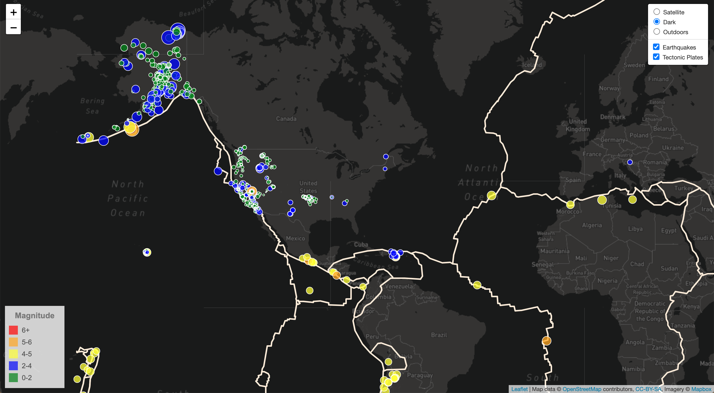
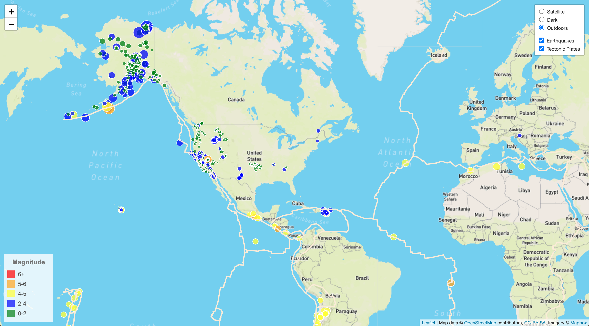
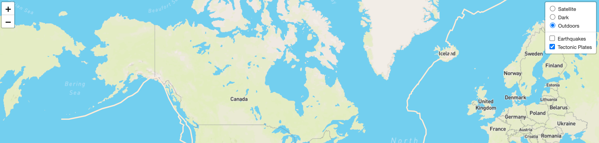
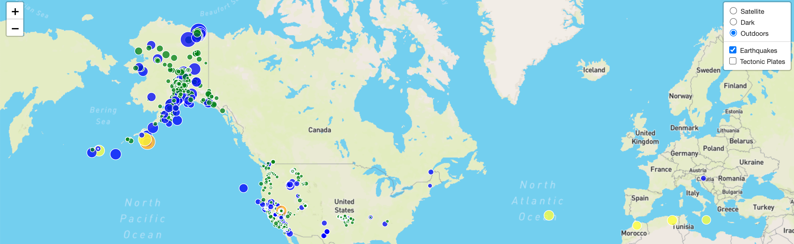
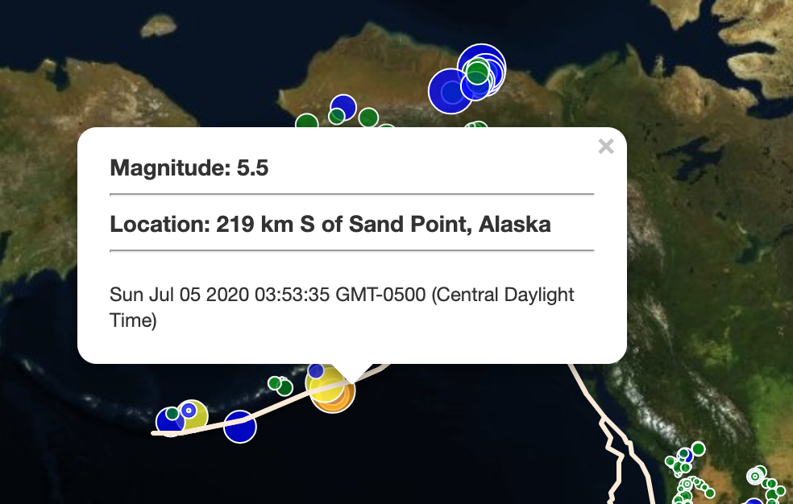
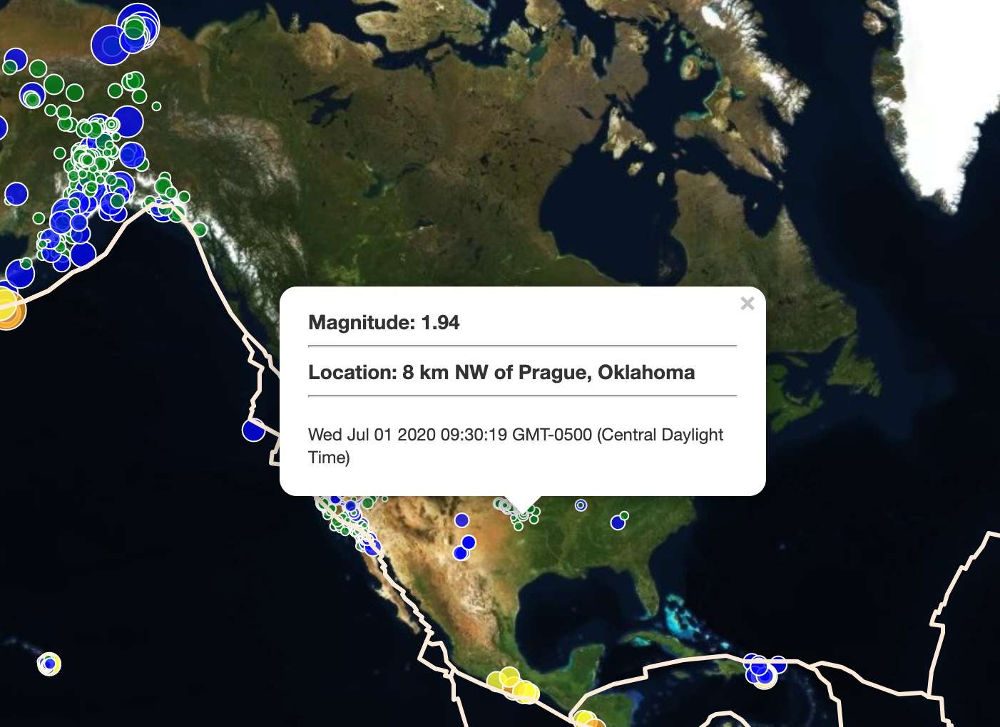

# Leaflet and Mapbox: Earthquakes and Tectonic Plates

Deployed URL: https://rdashcraft91.github.io/leaflet-challenge/Earthquakes&Plates_Leaflet/

Using USGS’s GeoJSON Feed, this website displays all earthquakes in the world in the past seven days. The map was created using the mapbox and leaflet JavaScript libraries. For reference, I added lines to show the earth’s tectonic plates, also obtained from the USGS.

The deployed application allows a user to activate and de-activate the earthquake and plate data, and also change the background layer among satellite, dark, and outdoor options.

Tools & Languages Used: 
- JSON
- GeoJSON
- JavaScript
- CSS
- Leaflet
- Mapbox

Below are screenshots from the application in use.

Full Page - Satellite:

Full Page - Dark:

Full Page - Outdoors:

Earthquakes Toggled Off:

Plateas Toggles Off:

Alaska Earthquake Clicked:

Oklahoma Earthquake Clicked:

